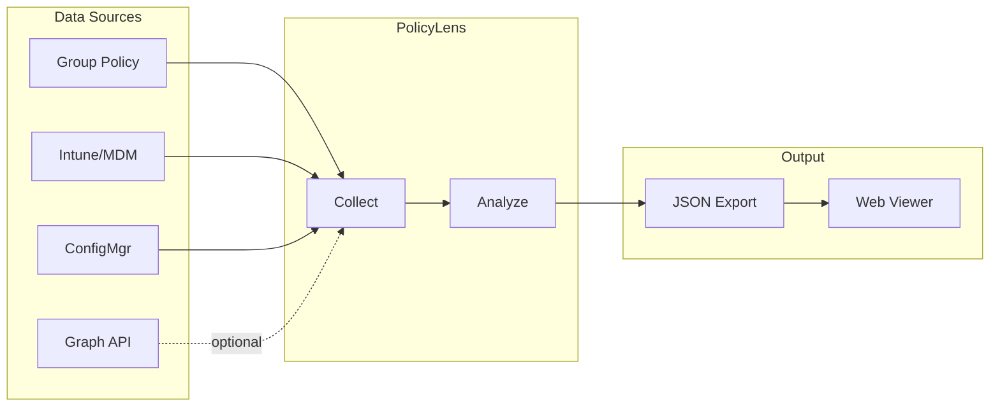

# PolicyLens

A PowerShell-based diagnostic tool that provides visibility into Windows device policy configuration across multiple management platforms: Group Policy, Microsoft Intune, and SCCM/ConfigMgr.

## Overview

PolicyLens scans a Windows device to collect and consolidate policy data from all active management sources, then exports the results to JSON for analysis in the included web viewer. This enables IT administrators to:

- Identify which policies are applied from each management source
- Detect conflicts where GPO and Intune configure the same setting differently
- Plan GPO-to-Intune migration by seeing which settings have MDM equivalents
- Compare policy configurations across multiple devices

## How It Works



## Features

| Capability | Description |
|------------|-------------|
| **Group Policy Collection** | Enumerates applied GPOs and scans registry-based policy settings |
| **Intune/MDM Collection** | Reads MDM enrollment status and PolicyManager CSP settings |
| **SCCM Collection** | Collects ConfigMgr applications, compliance baselines, and software updates |
| **Graph API Integration** | Retrieves Intune profiles, app assignments, and Azure AD group memberships |
| **Overlap Analysis** | Cross-references GPO settings against Intune CSP mappings |
| **Web Viewer** | Interactive HTML tool for visualizing and comparing device exports |

## Requirements

- Windows 10/11
- PowerShell 5.1+ or PowerShell 7+
- Administrator privileges (recommended for full data collection)
- Microsoft.Graph PowerShell module (optional, for `-IncludeGraph`)

```powershell
# Install Graph module if needed
Install-Module Microsoft.Graph -Scope CurrentUser
```

## Quick Start

```powershell
# Basic local scan (GPO, MDM, SCCM)
.\PolicyLens.ps1

# Full scan including Intune profiles, apps, and group memberships
.\PolicyLens.ps1 -IncludeGraph

# Export to specific location
.\PolicyLens.ps1 -IncludeGraph -OutputPath "C:\Reports\device1.json"
```

## Parameters

| Parameter | Description |
|-----------|-------------|
| `-IncludeGraph` | Connect to Microsoft Graph API for Intune data and Azure AD group memberships |
| `-TenantId` | Azure AD tenant ID or domain for Graph authentication |
| `-SkipMDMDiag` | Skip mdmdiagnosticstool execution (faster scans) |
| `-OutputPath` | Custom path for JSON export file |
| `-LogPath` | Custom path for operational log file |

## Web Viewer

The `Tools/PolicyLensViewer.html` file provides an interactive interface for analyzing JSON exports:

1. Open `PolicyLensViewer.html` in any modern browser (no server required)
2. Drag and drop one or more JSON export files
3. View consolidated policy data with filtering and search
4. Compare two devices side-by-side to identify differences

**Key sections displayed:**
- Summary cards with policy counts and conflict indicators
- Intune policies and apps filtered to those assigned to the device
- GPO/Intune overlap analysis with migration readiness status
- Azure AD group memberships
- Raw policy details from all sources

## Graph API Permissions

When using `-IncludeGraph`, the following Microsoft Graph scopes are requested:

| Scope | Purpose |
|-------|---------|
| `DeviceManagementConfiguration.Read.All` | Intune configuration profiles |
| `DeviceManagementManagedDevices.Read.All` | Managed device information |
| `DeviceManagementApps.Read.All` | App assignments |
| `Directory.Read.All` | Azure AD group memberships |
| `Device.Read.All` | Device lookup in Azure AD |

## Module Functions

PolicyLens can be imported as a PowerShell module for programmatic access:

```powershell
Import-Module .\PolicyLens.psd1

# Individual data collection
$gpo = Get-GPOPolicyData
$mdm = Get-MDMPolicyData
$sccm = Get-SCCMPolicyData

# Analysis
$analysis = Compare-PolicyOverlap -GPOData $gpo -MDMData $mdm
$analysis.Summary
```

## Limitations

- **Read-only**: This tool only collects and reports data. It does not modify any policies.
- **GPO-to-MDM mapping**: The built-in settings map covers common policies but is not exhaustive.
- **Graph API**: Requires interactive authentication; service principal auth is not currently supported.

## License

MIT License - See [LICENSE](LICENSE) file for details.

## Author

Joshua Walderbach
